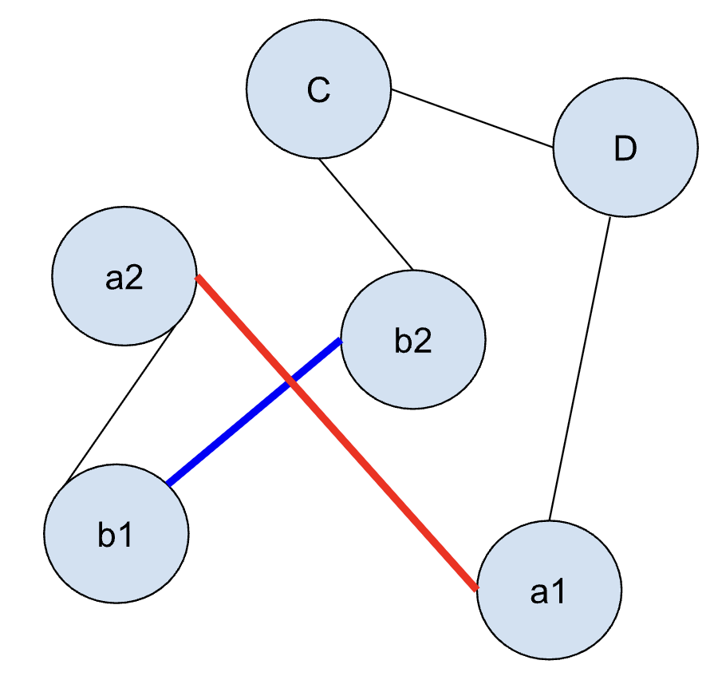
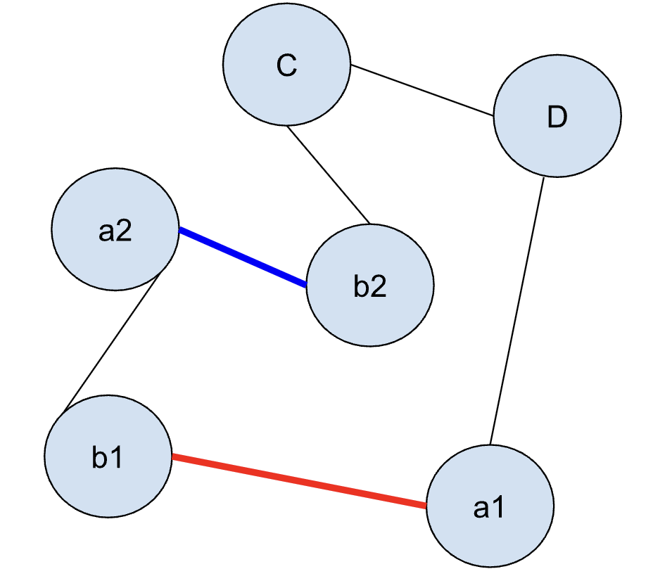

# Assignment1 の考え方

## 課題内容
TSPを実際に実装してみよう！

## 考え方
1. 近いノードから順番に繋ぐ　→ 2-opt法
    - 最小距離探索
    1. あるノードvを訪問済みにする
    2. あるノードvから、任意の点に対して一番小さい距離のノードuを繋ぐ
    3. uを訪問済みにする
    4. uに対して、任意の点に対して一番小さい距離のノードwを繋ぐ
    5. 3-4の操作を全てのノードが訪問済みになるまで繰り返す

    - 交差探索
    1. 4つともノードの異なる、2辺を取り出す
    2. a1a1_b1b2 = それぞれの辺の長さの合計を求める
    3. a1b1_a2b2 = それぞれの辺が交差しているとみなして、指すノードを入れ替えた場合の辺の長さの合計を求める
    4. (元々の辺の長さの合計) > (交差しているとみなし、入れ替えた場合の辺の長さの合計)
        であれば、指すノードを入れ替える
        
        
    5. 1-4を1つも交差がなくなるまで繰り返す

2. 1の方針に加え、最小距離探索における最初のノードをランダムに決定する
   また、処理を複数回繰り返し、そのなかで最小の距離となるノードの並びを返す

## Answer
[経路(ノード順)](Book1)
|Challenge| 経路長 |
|:---:|:---:|
|0|3291.62|
|1|3832.29|
|2|4494.42|
|3|8256.55|
|4|10885.95|
|5|20932.86|
|6|41894.18|

## open question
- 関数名
2_optなど数字が前にくるのはいいのか

- O(N^2 * ?)
交差してる間続けるは、?になにがはいるのか。
交差数はよめない。

- ノードの入れ替えについて、
loop_node[i+1:j+1] = reversed(loop_node[i+1:j+1])
と
loop_node[i+1] = b1
loop_node[j] = a2
の違い。
両端が変わるだけでも交差は取れるんじゃないかと考えたけど、無限ループした。